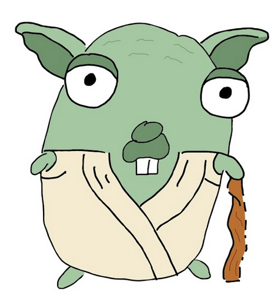
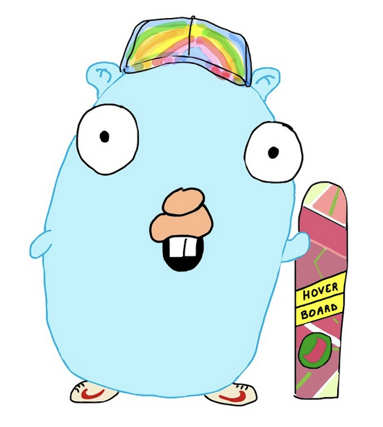

# Gopher artwork (Golang mascot)

This repository contains gopher artwork, based on the original artwork by [Renee French](http://reneefrench.blogspot.com/).

 

## Why

As I love Gophers, I started to draw more and more Gophers and I decided to share them in this GitHub repository.

## License

This work is licensed under a [Creative Commons Attribution-NonCommercial-ShareAlike 4.0 International License](https://creativecommons.org/licenses/by-nc-sa/4.0/).

This artwork can not be used for commercial purposes (anywhere revenue is obtained, including advertising).
